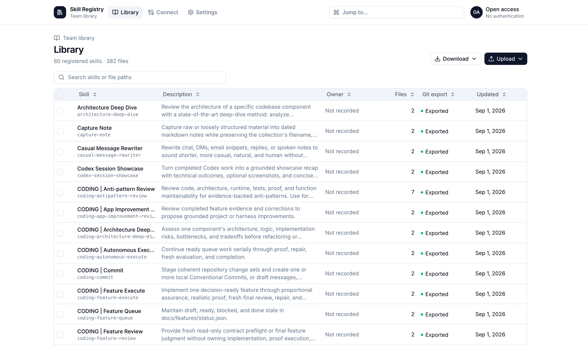

# Skill Registry



Skill Registry is a self-hosted catalogue where teams can publish, discover, version, and install skills for their agents. It can run completely open or use Google Workspace, with proposals and admin review. Accepted versions are also exported to Git, so history and backups do not depend on someone remembering which Slack thread contained the good copy.

The more AI tools a company adopts, the faster skills stop being “a few useful files” and become shared infrastructure. Shared infrastructure eventually needs a proper home.

## Setup

Requirements: Docker with Docker Compose.

From the repository root, start the application:

```bash
docker compose -f deployment/prod/compose.yaml up --build --detach --wait
```

Open [http://127.0.0.1:5175/setup](http://127.0.0.1:5175/setup) and complete the setup wizard:

1. Choose **Open full access** or **Google OIDC**.
2. Enter the public URL that users will use to reach this instance.
3. Choose the local Git repository name and, optionally, configure a remote.
4. For Google OIDC, add `<PUBLIC_URL>/api/auth/google/callback` as an authorized redirect URI in Google Cloud, then sign in with a configured administrator account.

Keep an unconfigured instance private until setup is complete. After setup, open [http://127.0.0.1:5175](http://127.0.0.1:5175).

## Deployment network configuration

Set these environment variables when running Docker Compose (or put them in a repository-root `.env` file):

| Variable | Default | Purpose |
| --- | --- | --- |
| `BACKEND_HOST` | `0.0.0.0` | Backend bind address inside its container. |
| `BACKEND_PORT` | `8000` | Backend listening port, also used by the frontend proxy and backend health check. |
| `BACKEND_UPSTREAM_HOST` | `backend` | Backend hostname or address reached from the frontend container. |
| `FRONTEND_BIND_ADDRESS` | `127.0.0.1` | Host address exposing the frontend. |
| `FRONTEND_PORT` | `5175` | Host port exposing the frontend. |

For example:

```bash
BACKEND_PORT=9000 docker compose -f deployment/prod/compose.yaml up --build --detach --wait
```

Use a backend bind address reachable from the frontend container; binding to `127.0.0.1` confines the backend to its own container. Compose also publishes the backend on the host's `127.0.0.1` at `BACKEND_PORT`; for example, `BACKEND_PORT=9000` makes its health endpoint available at `http://localhost:9000/health`. When running the images directly, the backend accepts `HOST` and `PORT`, and the frontend accepts `BACKEND_HOST` and `BACKEND_PORT` at container startup, without rebuilding its bundle.
